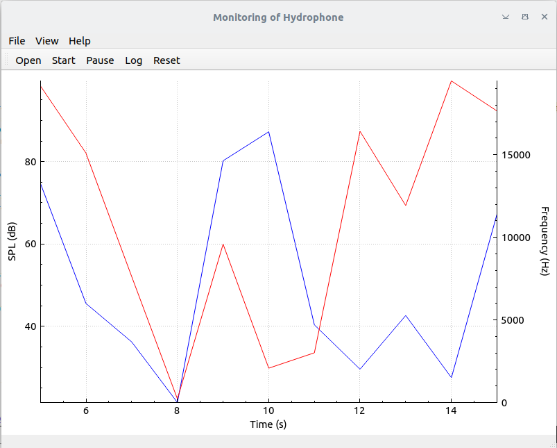

## Hydrophone Monitor

This is simulation project, using Qt and C++ project. It uses qmake to generate make file

## Install

1. Install Qt and qt creator

## Usage

Open project with Qt Creator, run the project

